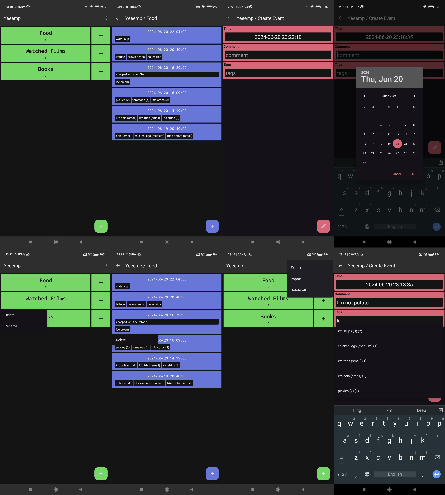

# Yeeemp


Tag-based event tracker for rawr, uwu and merp


# Gallery




# Features

* Multiple separate queues for your events
* Each event has tags, comment and date with time
* Tags are unique within each queue and support search-input when editing event
* Database export and import based on Documents API


# License

```
Yeeemp - tag based event counter
Copyright (C) 2024-2025  pegasko

This program is free software: you can redistribute it and/or modify
it under the terms of the GNU Affero General Public License as published by
the Free Software Foundation, either version 3 of the License, or
(at your option) any later version.

This program is distributed in the hope that it will be useful,
but WITHOUT ANY WARRANTY; without even the implied warranty of
MERCHANTABILITY or FITNESS FOR A PARTICULAR PURPOSE.  See the
GNU Affero General Public License for more details.

You should have received a copy of the GNU Affero General Public License
along with this program.  If not, see <https://www.gnu.org/licenses/>.
```
